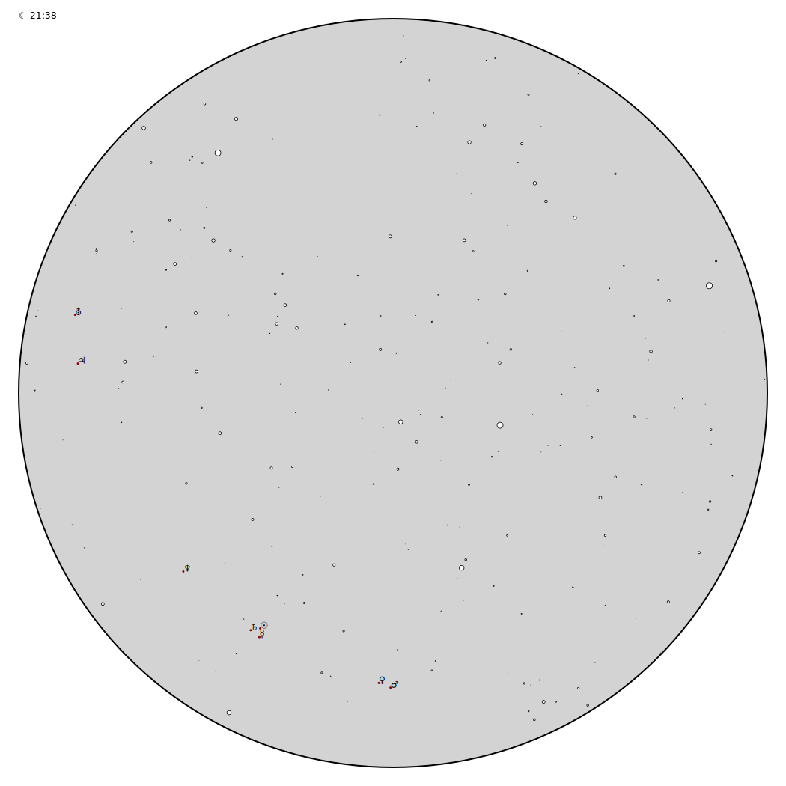

# Planisfeer

[Eise](eise.md) [Ptolemeus](ptolemeus.md) [Planisfeer](planisfeer.md)

A similar script draws an svg file with a plot of the stars in the sky
and the locations of the planets. I put the svg on a webserver to make
it available over the net.

 
