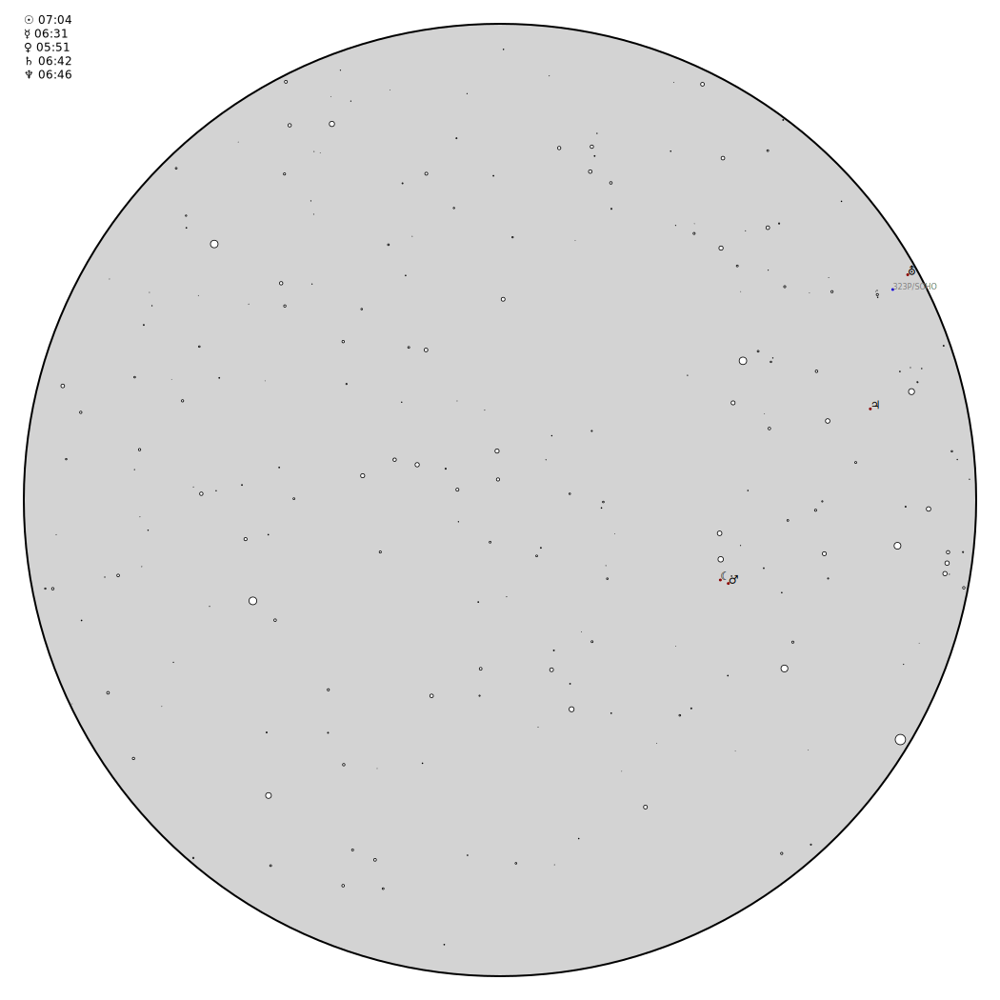

# Planisfeer

[Eise](eise.md) [Ptolemeus](ptolemeus.md) [Planisfeer](planisfeer.md)

Script om de avondhemel te tekenen voor een tijd en plaats. Het is
afgeleid van de eise script. Alleen tekent dit de hele hemel. De
dischtbijzijnde kometen worden ook ingetekend. Deze worden uitgelezen
uit een file waarin de locaties van de dischtsbijzijnde kometen staan.

Alles wordt als svg file uitgevoerd.

 
