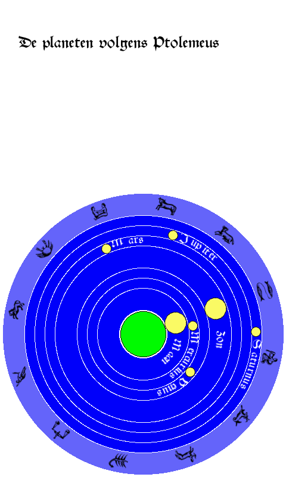

# Ptolemeus

[Eise](eise.md) [Ptolemeus](ptolemeus.md) [Planisfeer](planisfeer.md)

In het middeleeuwse beeld van het heelal staat de Aarde onwrikbaar in het midden, 
omgeven door _sferen_ waarin Zon, Maan en de planeten rond de Aarde draaien. Voor 
een middeleeuwer gaven Zon en Maan de tijd en de datum aan. De tijden waarop de
monikken in een klooster samen hun diensten hielden werden bepaald door de stand 
van de Zon. Als de Zon opkwam was het tijd voor _lauden_, de dienst waarmee de
dag begonnen werd. Ging de Zon onder dan was het tijd voor de _vespers_ dienst. 
De reis van de Zon langs de dierenriem gaf aan wat de dag in het jaar was. 

Dit script laat zien waar Zon, Maan en de planeten staan ten opzichte van 
de waarnemer. Het is gemaakt voor een Pimoroni Inky e-ink scherm. De naam 
Ptolemeas komt van de griekse astronoom die het sferenmodel beschreven heeft
en wat in de middeleeuwen het leidende kosmologische model was. De planeten 
bewogen in dit model in sferen rond de Aarde waarbij de beweging van de 
planeten beschreven werd met cirkels op cirkels, de _epicirkels_.

Het model van Ptolemeus was nauwkeuriger dan je zou denken. Planeten bewogen
in cirkels op cirkels. Maar er zat een aardige benadering in voor de niet-constante
snelheid die planeten in een ellipsbaan hebben. Planeten bewogen in Ptolemeus'
model in hun hoofdcirker (de _deferent_) niet met constante hoeksnelheid om het centrum.
Hun snelheid was constant vanuit een punt buiten het middelpunt, de _equans_. De Aarde
staat in dit model in een punt aan de andere kant van het middelpunt op dezelfde
afstand als de equans. De deferent is dus een cirkelbaan, maar met een eccentriciteit.
Voor Mars ziet dat er zo uit.

Het programma berekent alle planeetposities en tekent ze op een e-ink scherm.
Het scherm laat de planeten zien in hun sferen zoals deze rond de Aarde 
bewegen. De buitenste sfeer is de sfeer van de sterren, hier aangegeven met 
de tekens van de Dierenriem.

De posities van de planeten aan de hemel wordt berekend met Ptolemeus'
epicirkels.

